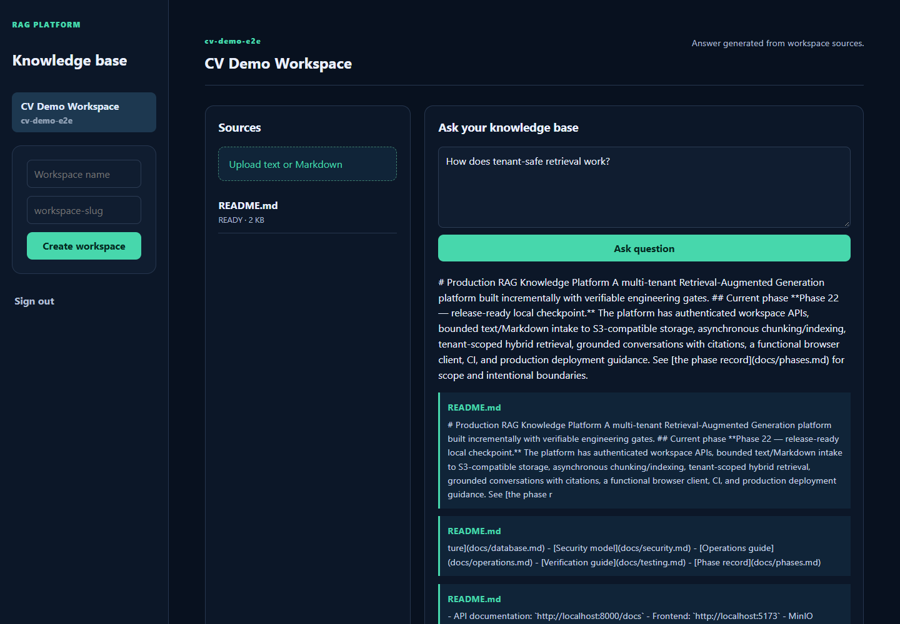

# Production RAG Knowledge Platform

A multi-tenant Retrieval-Augmented Generation platform built incrementally with verifiable engineering gates.

## Live demo

[Open the portfolio demo](https://3amooor.github.io/production-rag-knowledge-platform/)

The hosted demo is a safe, browser-only showcase with realistic seeded data, so recruiters can explore the product without credentials or infrastructure. The complete authenticated system runs locally with Docker Compose as described below.



## What it demonstrates

- JWT authentication with registration, login, refresh-token rotation, and tenant isolation
- Workspace-scoped document upload to S3-compatible object storage
- Asynchronous Celery ingestion with deterministic chunking and embeddings
- Hybrid PostgreSQL full-text and pgvector retrieval
- Grounded conversational answers with inspectable source citations
- React/TypeScript dashboard, FastAPI service, PostgreSQL, Redis, MinIO, and Docker Compose
- Automated lint, unit, build, migration, and browser-level acceptance checks

## Current phase

**Phase 22 — release-ready local checkpoint.** The platform has authenticated workspace APIs, bounded text/Markdown intake to S3-compatible storage, asynchronous chunking/indexing, tenant-scoped hybrid retrieval, grounded conversations with citations, a functional browser client, CI, and production deployment guidance. See [the phase record](docs/phases.md) for scope and intentional boundaries.

## Local prerequisites

- Docker Desktop with Docker Compose
- Optional: Python 3.12+ and Node.js 24+ for running services outside Docker

## Quick start

```powershell
Copy-Item .env.example .env
docker compose up --build
```

Then verify:

- API liveness: `http://localhost:8000/health`
- API documentation: `http://localhost:8000/docs`
- Frontend: `http://localhost:5173`
- MinIO console: `http://localhost:9001`

The current intake API accepts UTF-8 plain-text and Markdown files. A successful
upload is queued for background chunking and indexing; poll the document status
before querying newly uploaded content.

Stop services with `docker compose down`. Add `--volumes` only when you intentionally want to remove local database, Redis, and object-storage data.

## Quality checks

From `backend/` with Python 3.12 installed:

```powershell
pip install ".[dev]"
ruff check .
ruff format --check .
pytest tests/unit
```

From `frontend/`:

```powershell
npm install
npm run build
```

The GitHub Actions workflows run the backend checks, frontend build, and a GitHub Pages deployment for the browser-only portfolio demo.

## Architecture status

Project documentation:

- [Architecture](docs/architecture.md)
- [API reference](docs/api.md)
- [Database architecture](docs/database.md)
- [Security model](docs/security.md)
- [Operations guide](docs/operations.md)
- [Verification guide](docs/testing.md)
- [Phase record](docs/phases.md)
